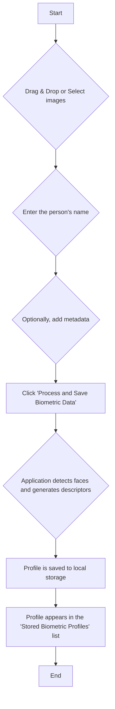
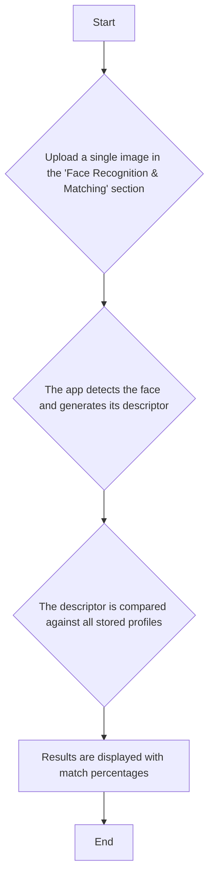

# xsukax Face Recognition Biometric Manager

[](https://www.gnu.org/licenses/gpl-3.0)

A powerful, 100% client-side application for creating, managing, and utilizing face recognition biometric profiles. All processing and data storage happens directly in your browser, ensuring that your sensitive data never leaves your machine.

**[Live Demo](https://xsukax.github.io/xsukax-Face-Recognition-Biometric-Manager/)**

## Project Overview

The xsukax Face Recognition Biometric Manager is a serverless web application that leverages the power of modern JavaScript libraries to provide a complete biometric management system. Users can add individuals by name, upload multiple photos to create robust facial descriptors, and later identify them by uploading a new image for matching. The application is designed with privacy and security as its core principles, making it a safe and reliable tool for on-device identity verification.

---

## Security and Privacy Benefits

This application is built from the ground up to guarantee user privacy and data security. There is no server-side component, meaning your data is never transmitted over the internet or stored on a third-party server.

*   **100% Client-Side Operation**: All face detection, descriptor generation, and matching calculations are performed locally in your web browser using the `face-api.js` library.
*   **No Data Transmission**: Images and generated biometric data are never uploaded to any server. They remain exclusively on your device.
*   **Local Storage**: All biometric profiles are stored in your browser's `localStorage`. This data is persistent on your machine but is not accessible by other websites or external entities.
*   **Complete User Control**: You have full control over your data. The application provides intuitive features to export, import, or permanently delete individual or all biometric profiles.
*   **No External Tracking**: The application does not include any third-party analytics, trackers, or cookies that would compromise your privacy.

---

## Features and Advantages

*   **Serverless Architecture**: Runs entirely in the browser with no need for a backend, making it free to host and infinitely scalable for individual use.
*   **Robust Profile Creation**: Add multiple images per person to create a more accurate and reliable biometric profile.
*   **Accurate Face Matching**: Identifies individuals from an image by comparing their facial features against all stored profiles, providing a percentage-based confidence score.
*   **Full Data Portability**: Export individual or all profiles to a JSON file for backup or migration to another device.
*   **Easy Data Import**: Import profiles from JSON files, making it simple to restore data or share profiles securely.
*   **Profile Management**: Easily edit profile names and metadata, or delete profiles you no longer need.
*   **Modern, Responsive UI**: A clean and intuitive interface built with Tailwind CSS that works seamlessly on desktop devices.

---

## Installation Instructions

This application runs as a static website. You can use the live demo or run it locally by following these steps:

1.  **Clone the Repository**
    ```bash
    git clone https://github.com/xsukax/xsukax-Face-Recognition-Biometric-Manager.git
    cd xsukax-Face-Recognition-Biometric-Manager
    ```

2.  **Download the Models**
    The application requires pre-trained models from `face-api.js`.
    *   Download the model files from the original `face-api.js` repository [weights folder](https://github.com/justadudewhohacks/face-api.js/tree/master/weights).
    *   Create a folder named `model` in the root of the project directory.
    *   Place the downloaded model files (`.json` and `.bin`) into the `model` folder.

3.  **Run the Application**
    Because browsers have strict security policies (CORS) regarding loading files from the local file system, you need to serve the files through a local web server.
    *   If you have Python 3 installed, you can easily start a server:
        ```bash
        python -m http.server
        ```
    *   If you have Node.js installed, you can use a simple package like `serve`:
        ```bash
        npx serve
        ```
    *   Once the server is running, open your browser and navigate to the provided URL (e.g., `http://localhost:8000`).

---

## Usage Guide

### 1. Creating a New Biometric Profile

This process involves uploading one or more images of a person and saving their generated facial data.



### 2. Matching a Face

Use this feature to identify a person by uploading an image.



### 3. Managing Data

*   **Edit a Profile**: Click the `Edit` button on any profile to update the name and metadata.
*   **Export a Profile**: Click `Export` to save a single profile's data as a JSON file.
*   **Delete a Profile**: Click `Delete` to permanently remove a profile. A confirmation will be required.
*   **Backup All Data**: Use the `Export All Data` button to save all stored profiles into a single JSON file.
*   **Import Data**: Click `Import JSON` to select one or more exported JSON files and add them to your local database. The app automatically avoids importing duplicate profiles.

---

## Licensing Information

This project is licensed under the GNU General Public License v3.0.
