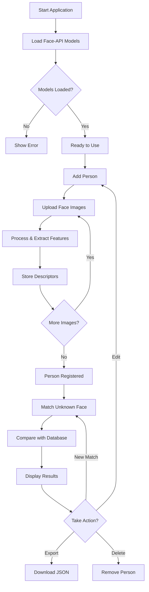
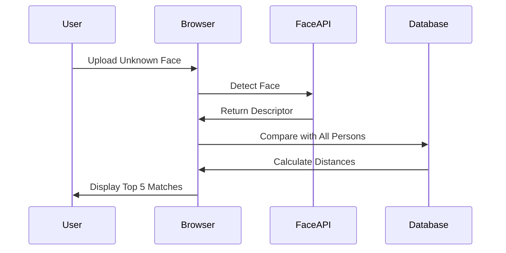

# xsukax Face Recognition Biometric Manager

A privacy-focused, client-side face recognition application that enables secure biometric data management entirely within your browser. No server uploads, no cloud storage—your facial data never leaves your device.

[](https://xsukax.github.io/xsukax-Face-Recognition-Biometric-Manager/)
[](LICENSE)
[](https://github.com/justadudewhohacks/face-api.js)

## 🎯 Project Overview

The **xsukax Face Recognition Biometric Manager** is a standalone web application that leverages advanced machine learning models to detect, recognize, and match human faces directly in the browser. Built with face-api.js (a JavaScript API for face detection and recognition), this tool allows users to:

- **Register multiple individuals** with their facial biometric data
- **Upload and process multiple face images** per person for improved accuracy
- **Match unknown faces** against a stored database of known individuals
- **Import and export** biometric datasets in JSON format for backup or transfer
- **Manage facial databases** with full CRUD (Create, Read, Update, Delete) operations

All processing occurs client-side using TensorFlow.js, ensuring that sensitive biometric information remains completely private and under the user's control.

## 🔒 Security and Privacy Benefits

### Complete Client-Side Processing
All face detection, feature extraction, and matching operations are performed entirely within your browser using WebAssembly and JavaScript. **No data is ever transmitted to external servers**, eliminating risks associated with cloud-based biometric systems.

### Local Storage Only
Facial descriptors and associated metadata are stored exclusively in your browser's localStorage. This ensures:
- **Zero server-side data breaches**: Since no data leaves your device, server compromises cannot expose your biometric information
- **User-controlled data**: You maintain complete ownership and can clear all data instantly
- **No third-party access**: No analytics, tracking, or external services have access to your facial data

### Transparent Data Management
- **JSON export/import**: Full transparency in data format allows users to inspect, backup, and migrate their biometric databases
- **Individual person export**: Granular control over data sharing and storage
- **One-click data deletion**: Immediate and complete removal of all biometric information

### No Authentication Required
The application requires no user accounts, passwords, or personal identification, further reducing privacy risks and attack surfaces.

### Open Source Auditing
As an open-source project, the entire codebase is available for security audits, ensuring no hidden data collection or malicious behavior.

## ✨ Features and Advantages

### Core Capabilities
- **Multi-Face Detection**: Automatically detects and processes multiple faces in a single image
- **Facial Feature Extraction**: Generates 128-dimensional facial descriptors for accurate recognition
- **Similarity Matching**: Compares uploaded faces against stored biometric data with percentage-based confidence scores
- **Batch Processing**: Handle multiple images simultaneously with progress tracking
- **Visual Feedback**: Real-time progress bars and status updates during image processing

### User Experience
- **Intuitive Interface**: Clean, modern UI built with Tailwind CSS for responsive design
- **Drag-and-Drop Support**: Easy image uploads via drag-and-drop or file browser
- **Person Management**: Organize faces by individual with names and descriptions
- **Face Gallery**: Visual representation of all stored facial images per person
- **Color-Coded Results**: Green, yellow, and red indicators for match confidence levels

### Data Management
- **Flexible Import/Export**: JSON-based data exchange for easy backup and portability
- **Selective Exports**: Export individual persons or entire databases
- **Bulk Import**: Import multiple person records simultaneously
- **Face Removal**: Delete individual facial images while retaining person records
- **Complete Reset**: Clear all stored data with a single action

### Technical Advantages
- **Offline Capability**: Works without internet connection after initial model loading
- **No Dependencies on External APIs**: Self-contained application with embedded ML models
- **Cross-Platform**: Runs on any modern browser (desktop or mobile)
- **Lightweight**: Minimal resource footprint using TinyFaceDetector for efficiency

## 📋 Installation Instructions

### Prerequisites
- A modern web browser with JavaScript enabled (Chrome, Firefox, Safari, Edge)
- Basic understanding of face recognition concepts (optional but helpful)

### Standard Installation

1. **Clone the Repository**
   ```bash
   git clone https://github.com/xsukax/xsukax-Face-Recognition-Biometric-Manager.git
   cd xsukax-Face-Recognition-Biometric-Manager
   ```

2. **Serve the Application**
   
   Use any static web server to serve the files. Examples:
   
   **Using Python 3:**
   ```bash
   python -m http.server 8000
   ```
   
   **Using Node.js (http-server):**
   ```bash
   npx http-server -p 8000
   ```
   
   **Using PHP:**
   ```bash
   php -S localhost:8000
   ```

3. **Access the Application**
   
   Open your browser and navigate to:
   ```
   http://localhost:8000
   ```

### Quick Start (Using GitHub Pages)

Access the live demo directly without installation:
```
https://xsukax.github.io/xsukax-Face-Recognition-Biometric-Manager/
```

## 📖 Usage Guide

### Application Workflow



### Step-by-Step Instructions

#### 1. Adding a Person

1. Click the **"Add Person"** button in the Person Management section
2. Enter the person's name (required) and optional description
3. Click **"Add Person"** to create the record
4. The new person card will appear with 0 faces registered

#### 2. Uploading Face Images

1. Locate the person card you just created
2. Click **"Add Face Images"** button on the person card
3. Select one or multiple images containing the person's face
4. The application will:
   - Display a processing modal with progress bar
   - Detect faces in each image
   - Extract 128-dimensional facial descriptors
   - Store the biometric data locally
5. The person card will update showing the number of registered faces

**Best Practices for Face Images:**
- Use clear, well-lit photos
- Ensure faces are clearly visible and unobstructed
- Include multiple angles and expressions for better accuracy
- Recommended: 3-10 images per person for optimal matching

#### 3. Matching Faces



1. Navigate to the **Face Matching** section
2. Drag and drop an image into the drop area, or click **"Browse Files"**
3. The application will:
   - Display the uploaded image preview
   - Detect faces in the image
   - Compare against all registered persons
   - Calculate similarity scores (0-100%)
4. Review the results showing:
   - **Green (>70%)**: High confidence match
   - **Yellow (40-70%)**: Moderate confidence match
   - **Red (<40%)**: Low confidence match

#### 4. Managing Person Data

**Edit Person Details:**
1. Click the edit icon (pencil) on any person card
2. Modify name or description
3. View all registered face images as thumbnails
4. Remove individual face images by clicking the X button
5. Add more face images using the drop area in the edit modal
6. Click **"Save Changes"**

**Export Person Data:**
1. Click the export icon (download arrow) on the person card
2. A JSON file will be downloaded containing:
   - Person metadata (name, description, ID)
   - All facial descriptors
   - Image data (base64 encoded)
   - Timestamps and metadata

**Delete Person:**
1. Click the delete icon (trash can) on the person card
2. Confirm the deletion in the popup modal
3. All associated facial data will be permanently removed

#### 5. Data Management Operations

**Export All Data:**
1. Click **"Export All Data"** in the header
2. Downloads a JSON file containing all persons and their biometric data
3. Use this for backup or transferring to another device

**Import Data:**
1. Click **"Import Data"** in the Person Management section
2. Select one or more JSON files (exported person or full database files)
3. The application will merge the imported data with existing records

**Clear Storage:**
1. Click **"Clear Storage"** in the header (use with caution)
2. Confirm the action
3. All biometric data will be permanently deleted from localStorage

### Data Structure

The application stores data in the following JSON format:

```json
{
  "person_1699123456789_abc123": {
    "id": "person_1699123456789_abc123",
    "name": "John Doe",
    "description": "Employee ID: 12345",
    "faces": [
      {
        "id": "face_1699123456790_xyz789",
        "descriptor": [0.123, -0.456, ...],
        "imageData": "data:image/jpeg;base64,...",
        "timestamp": "2024-11-08T10:30:00.000Z",
        "metadata": {
          "filename": "john_face.jpg",
          "description": "Detected face"
        }
      }
    ]
  }
}
```

### Privacy Recommendations

1. **Regular Backups**: Export your data periodically to prevent loss due to browser cache clearing
2. **Secure Storage**: Store exported JSON files in encrypted locations if they contain sensitive information
3. **Browser Privacy**: Use private/incognito mode if sharing a device to prevent localStorage persistence
4. **Data Minimization**: Only store necessary facial images; delete unused entries regularly
5. **Access Control**: Ensure physical security of devices running this application

## 📄 Licensing Information

This project is licensed under the GNU General Public License v3.0.

---

## 🤝 Contributing

Contributions are welcome! Please feel free to submit issues, fork the repository, and create pull requests for bug fixes or new features.

## 🙏 Acknowledgments

- [face-api.js](https://github.com/justadudewhohacks/face-api.js) - JavaScript face recognition library
- [TensorFlow.js](https://www.tensorflow.org/js) - Machine learning framework for JavaScript
- [Tailwind CSS](https://tailwindcss.com/) - Utility-first CSS framework

## ⚠️ Disclaimer

This application is provided as-is for educational and personal use. While it implements strong privacy protections, users should understand the limitations of browser-based biometric systems and use appropriate security measures when handling sensitive facial recognition data. The accuracy of face matching depends on image quality, lighting conditions, and the number of reference images stored per person.

## 📞 Support

For issues, questions, or suggestions, please visit the [GitHub Issues](https://github.com/xsukax/xsukax-Face-Recognition-Biometric-Manager/issues) page.

---

**Built with privacy in mind. Your face, your data, your control.**
